# 编译原理例题与练习题答案解析

本文件是 `编译原理例题与练习题整理.md` 的答案版。  
截图放在 `assets/例题截图/`，主要覆盖原课件中依赖语法树、DFA、表格、DAG、活动记录等图片才能看清的题。

说明：部分课件例题本身是“方法演示”而不是完整题目，我把它们整理为“答案要点 + 解析”，方便直接复习。

---

## 第 1 章 引论

### 1. `sum=(10+20)*(num+square);` 的词法分析

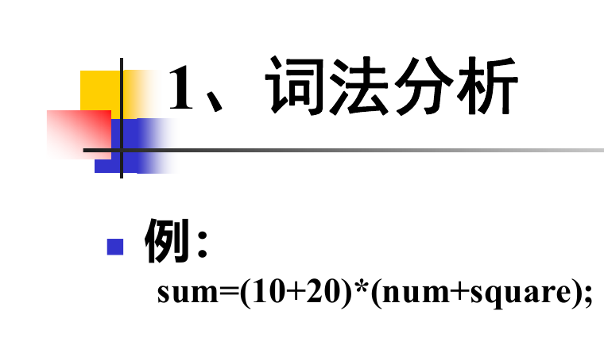

答案：

```text
(标识符, sum)
(赋值号, =)
(左括号, ()
(整常数, 10)
(加号, +)
(整常数, 20)
(右括号, ))
(乘号, *)
(左括号, ()
(标识符, num)
(加号, +)
(标识符, square)
(右括号, ))
(分号, ;)
```

解析：词法分析只负责把字符流切成单词符号，不负责判断表达式优先级。标识符的属性值通常是名字本身或符号表入口，常数的属性值是数值。

### 2. `sum=(10+20)*(num+square);` 的中间表示

一种三地址码/四元式思路：

```text
t1 := 10 + 20
t2 := num + square
t3 := t1 * t2
sum := t3
```

后缀式：

```text
sum 10 20 + num square + * =
```

前缀式：

```text
= sum * + 10 20 + num square
```

四元式：

```text
(+, 10, 20, t1)
(+, num, square, t2)
(*, t1, t2, t3)
(=, t3, -, sum)
```

解析：中间代码要显式表达计算顺序。括号决定先算 `10+20` 和 `num+square`，再乘，最后赋值。

### 3. 机器语言、汇编语言、高级语言对照

答案要点：

- 机器语言：机器可直接执行，二进制编码，可读性差。
- 汇编语言：用助记符表示机器指令，仍然依赖具体机器。
- 高级语言：接近问题描述，需经编译或解释才能执行。

解析：这一题通常考“为什么需要编译器”。高级语言提高表达能力，编译器负责把它翻译成目标机能执行的低级代码。

### 4. T 形图、自展、移植

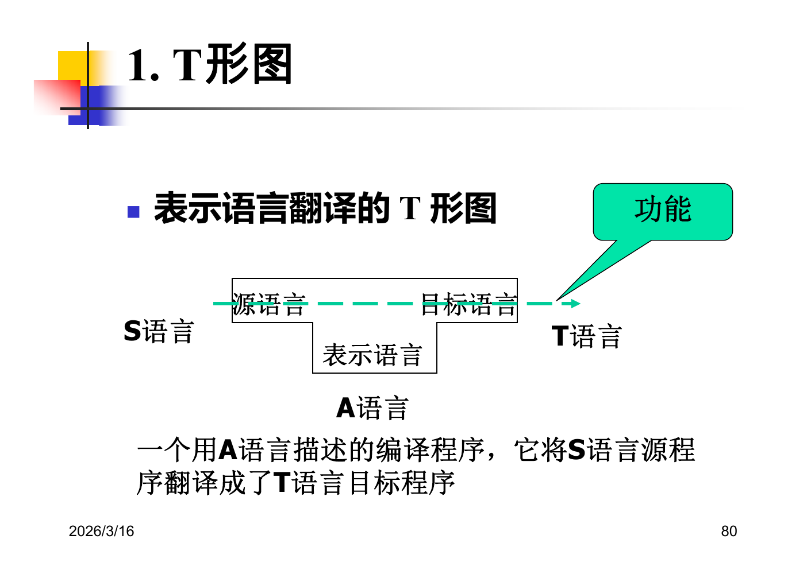

答案要点：

- T 形图上方左边是源语言，右边是目标语言，下方是实现该编译器所用语言。
- 自展：先实现一个小语言子集编译器，再用它编译更完整的编译器。
- 移植：已有 A 机上的编译环境时，用高级语言写 B 机目标编译器，再在 A 机上交叉编译出可在 B 机运行的编译器。

解析：T 图题核心是分清“编译器运行在哪台机器上”“输入语言是什么”“输出目标语言是什么”。

### 5. 解释程序、编译程序等概念辨析

答案：

| 名称 | 源程序 | 目标/结果 | 特点 |
| --- | --- | --- | --- |
| 解释程序 | 高级语言 | 直接执行结果 | 边解释边执行 |
| 编译程序 | 高级语言 | 汇编/机器目标程序 | 先整体翻译再执行 |
| 汇编程序 | 汇编语言 | 机器语言 | 助记符到机器码 |
| 交叉编译程序 | 高级语言 | 另一台机器的目标代码 | 编译器运行机与目标机不同 |
| 反编译程序 | 低级代码 | 较高级表示 | 机器/字节码反向恢复 |

解析：考试常见问法是“源语言和目标语言分别是什么”。

---

## 第 2 章 高级语言及其文法

### 1. 字母表乘积与幂

答案：

```text
Σ1={0,1}, Σ2={a,b}
Σ1Σ2={0a,0b,1a,1b}

{0,1}^3={000,001,010,011,100,101,110,111}
```

解析：字母表乘积是从前一个集合取一个字符、后一个集合取一个字符并置。`Σ^n` 是长度为 `n` 的所有串。

### 2. 正闭包与 Kleene 闭包

答案：

```text
{0,1}+ = 所有长度 >= 1 的二进制串
{0,1}* = 所有长度 >= 0 的二进制串 = {ε} ∪ {0,1}+
```

解析：`+` 不含空串，`*` 含空串。

### 3. 例 2.9：赋值语句文法

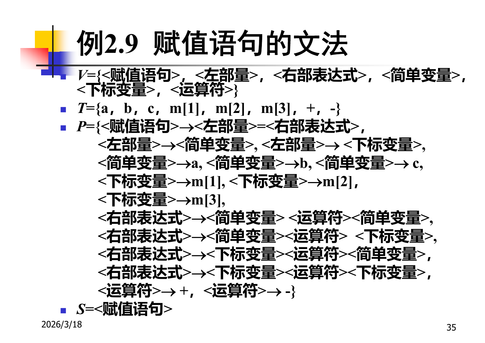

答案：

```text
G = (V, T, P, S)
V = {A, B, E, C, D, O}
T = {a, b, c, m[1], m[2], m[3], +, -, =}
S = A

P:
A → B = E
B → C | D
C → a | b | c
D → m[1] | m[2] | m[3]
E → C O C | C O D | D O C | D O D
O → + | -
```

解析：`A` 表示赋值语句，`B` 表示左部量，`E` 表示右部表达式，`C/D/O` 分别表示简单变量、下标变量、运算符。

### 4. 证明 `a=b+m[1]` 是文法 `G1` 的句子

答案：

```text
A ⇒ B=E
  ⇒ C=E
  ⇒ a=E
  ⇒ a=C O D
  ⇒ a=b O D
  ⇒ a=b + D
  ⇒ a=b+m[1]
```

解析：只要能从开始符号推出一个全由终结符组成的串，该串就是文法的句子。

### 5. 判断文法类型

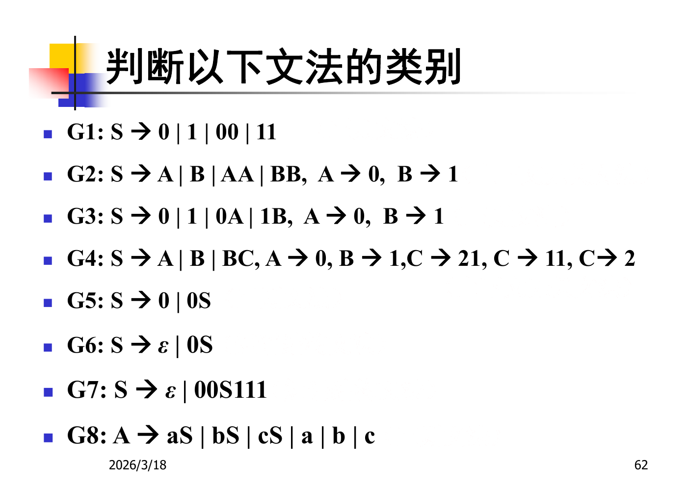

答案：

| 文法 | 类别 |
| --- | --- |
| G1 | 正则文法 |
| G2 | 上下文无关文法 |
| G3 | 正则文法 |
| G4 | 上下文无关文法 |
| G5 | 正则文法 |
| G6 | 短语结构文法 |
| G7 | 短语结构文法 |
| G8 | 正则文法 |

答案规则：

- 0 型：产生式基本无限制，左部至少含一个非终结符。
- 1 型：一般满足 `|左部| <= |右部|`，除开始符号推出空串的特殊情况。
- 2 型 CFG：每个产生式左部是单个非终结符。
- 3 型正则文法：右线性 `A→aB|a` 或左线性 `A→Ba|a`，不能混用方向。

解析：做题时从最严格的 3 型开始判断；不满足再看 2 型、1 型、0 型。

### 6. `{0123456}` 的左线性和右线性文法

答案：

右线性：

```text
S → 0A
A → 1B
B → 2C
C → 3D
D → 4E
E → 5F
F → 6
```

左线性：

```text
S → A6
A → B5
B → C4
C → D3
D → E2
E → F1
F → 0
```

解析：右线性从左往右“预留后续状态”；左线性从右往左构造。

### 7. `id+id*id` 的语法树、最左/最右推导

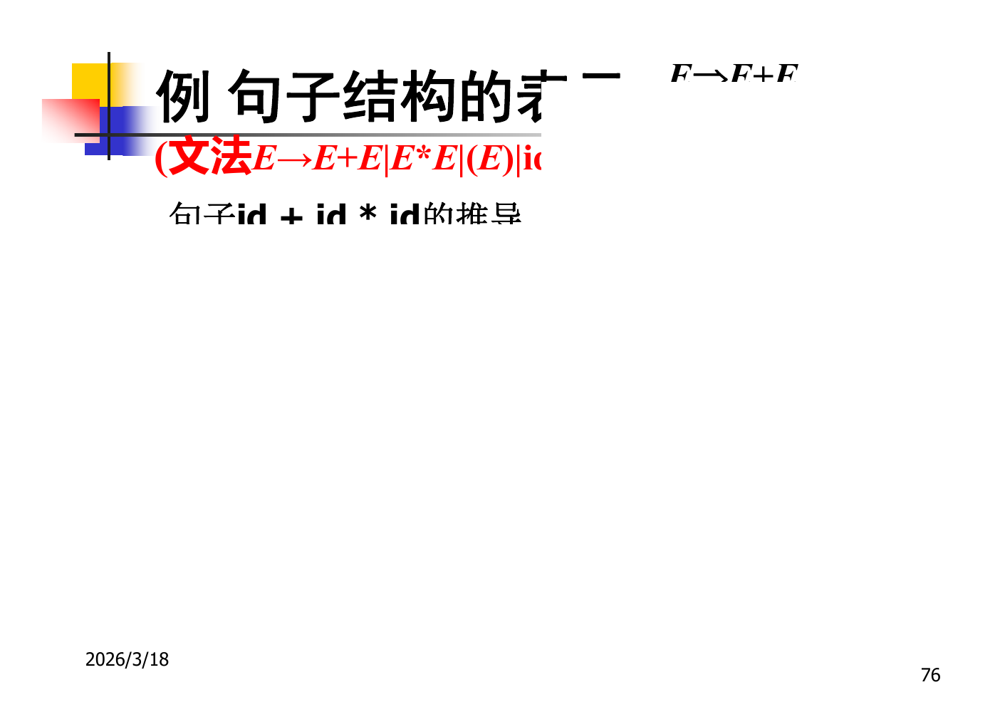

以文法 `E→E+E|E*E|(E)|id` 为例，一条最左推导：

```text
E ⇒ E+E
  ⇒ id+E
  ⇒ id+E*E
  ⇒ id+id*E
  ⇒ id+id*id
```

一条最右推导：

```text
E ⇒ E+E
  ⇒ E+E*E
  ⇒ E+E*id
  ⇒ E+id*id
  ⇒ id+id*id
```

解析：同一棵语法树可能对应不同推导顺序；但如果同一句子能有两棵不同语法树，则文法二义。

### 8. 短语、直接短语、句柄

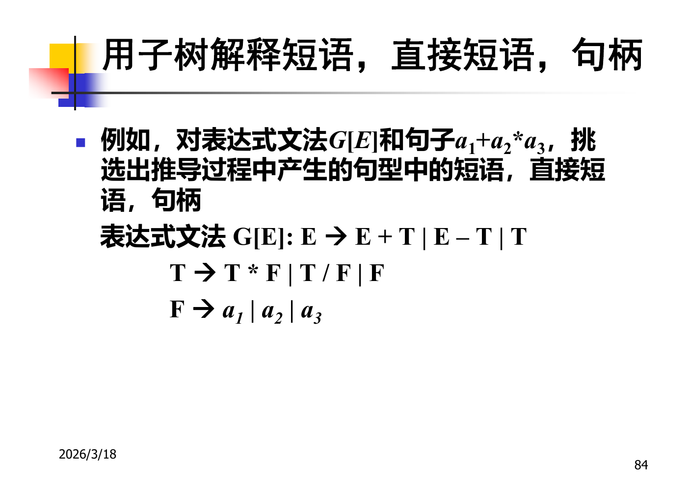

对句型 `a1+a2*a3` 的典型答案：

- 短语：`a1`、`a2`、`a3`、`a2*a3`、`a1+a2*a3`。
- 直接短语：叶子直接由某个非终结符一步推出的部分，如 `a1`、`a2`、`a3`。
- 句柄：当前句型的最左直接短语。

解析：短语对应语法树中某棵子树的叶子串；直接短语对应高度为 1 的子树；句柄是自底向上分析下一步要归约的对象。

### 9. 二义性证明：`E→E+E|E*E|(E)|id`

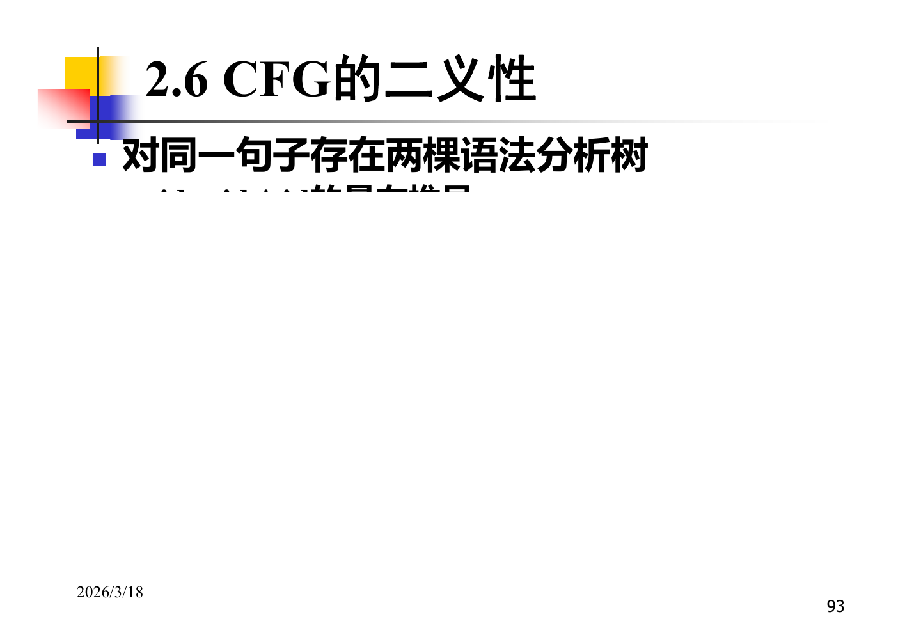

答案：句子 `id+id*id` 有两种结构：

```text
id + (id * id)
(id + id) * id
```

对应两棵不同语法树，因此该文法二义。

解析：证明二义性不能只说“看起来有歧义”，必须给出一个具体句子，并展示两棵树或两条不同最左推导。

### 10. 消除表达式二义性

答案：

```text
E → E + T | T
T → T * F | F
F → id | (E)
```

解析：把优先级低的 `+` 放在较高层 `E`，把优先级高的 `*` 放在较低层 `T`，使 `*` 更先结合。

### 11. 语言构造练习答案

1. 以 `a` 开头、以 `b` 结尾，字母表 `{a,b,c}`：

```text
S → a M b
M → aM | bM | cM | ε
```

2. 二进制偶数：

```text
S → B0
B → 0B | 1B | ε
```

若不允许多位数前导 0，可另设 `S→0|1C0`，`C→0C|1C|ε`。

3. 长度至少 2 的十进制数字串：

```text
S → D D T
T → D T | ε
D → 0|1|2|3|4|5|6|7|8|9
```

4. 不包含 `00` 的二进制串：

```text
S → 1S | 0A | ε
A → 1S | ε
```

5. `a^n b^n`：

```text
S → a S b | ε       // n>=0
S → a S b | ab      // n>=1
```

6. `a^n b^n c^m`：

```text
S → T C
T → a T b | ε
C → c C | ε
```

7. 括号匹配：

```text
S → (S)S | ε
```

8. `{a,b}` 上回文串：

```text
S → aSa | bSb | a | b | ε
```

解析：格式题靠“前缀/中间/后缀”，数量配对和嵌套题靠递归。

---

## 第 3 章 词法分析

### 1. 例 3.1：`if count>7 then result := 3.14;`

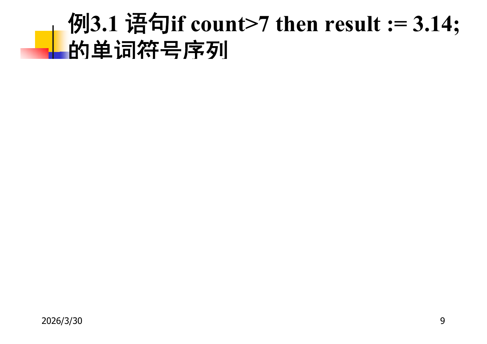

答案：

```text
(IF, -)
(ID, count 的符号表入口)
(RELOP, >)
(NUM, 7)
(THEN, -)
(ID, result 的符号表入口)
(ASSIGN, :=)
(REAL, 3.14)
(SEMI, ;)
```

解析：关键字一般一符一类；标识符属性值指向符号表；常数属性值保存转换后的数值。

### 2. 标识符文法与正则式

答案：

```text
id → letter rest
rest → letter rest | digit rest | ε
letter → A|...|Z|a|...|z
digit → 0|1|...|9
```

正则式：

```text
letter(letter|digit)*
```

解析：标识符必须以字母开头，后续可以是字母或数字。

### 3. 正则文法转正则表达式

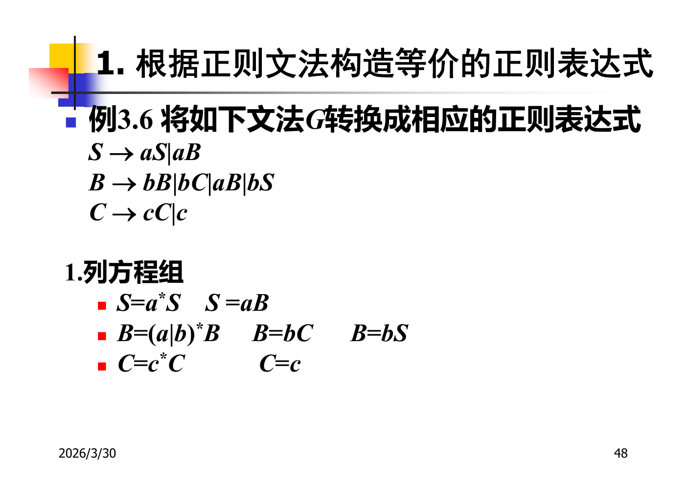

方法答案：为每个非终结符列一个语言方程，用 Arden 引理消元。

解析示例：

```text
S = aS ∪ aB
可化为 S = a* aB = a+ B
```

后续继续把 `B`、`C` 方程代入并化简。考试中写清“列方程 -> 消元 -> 得正则式”即可拿步骤分。

### 4. 正则式 `a(a|b)*` 转右线性文法

答案：

```text
S → aA
A → aA | bA | ε
```

解析：`S→aA` 保证首字符为 `a`，`A` 递归生成任意多个 `a/b`。

### 5. 奇偶 DFA：0 和 1 的个数都是偶数

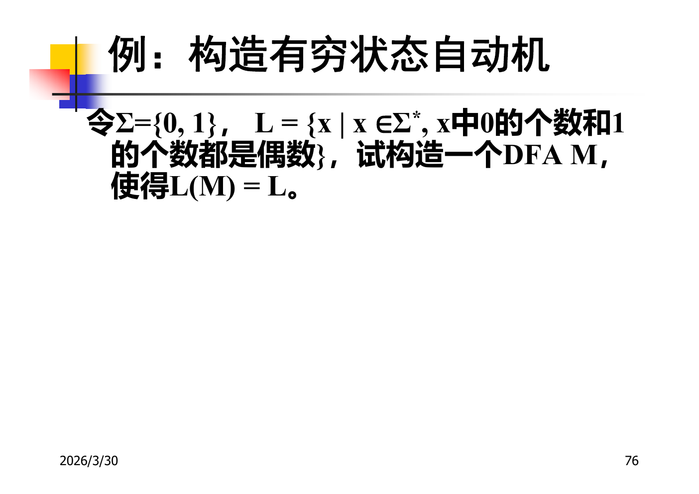

答案：设状态表示 `(0 的奇偶, 1 的奇偶)`：

```text
q00 = 偶0偶1    // 初态、终态
q01 = 偶0奇1
q10 = 奇0偶1
q11 = 奇0奇1
```

转移表：

| 状态 | 读 0 | 读 1 |
| --- | --- | --- |
| q00 | q10 | q01 |
| q10 | q00 | q11 |
| q01 | q11 | q00 |
| q11 | q01 | q10 |

解析：读到 `0` 翻转 0 的奇偶性，读到 `1` 翻转 1 的奇偶性。

### 6. 正则式 `ε|(0|1)01*|0+` 的状态转换图

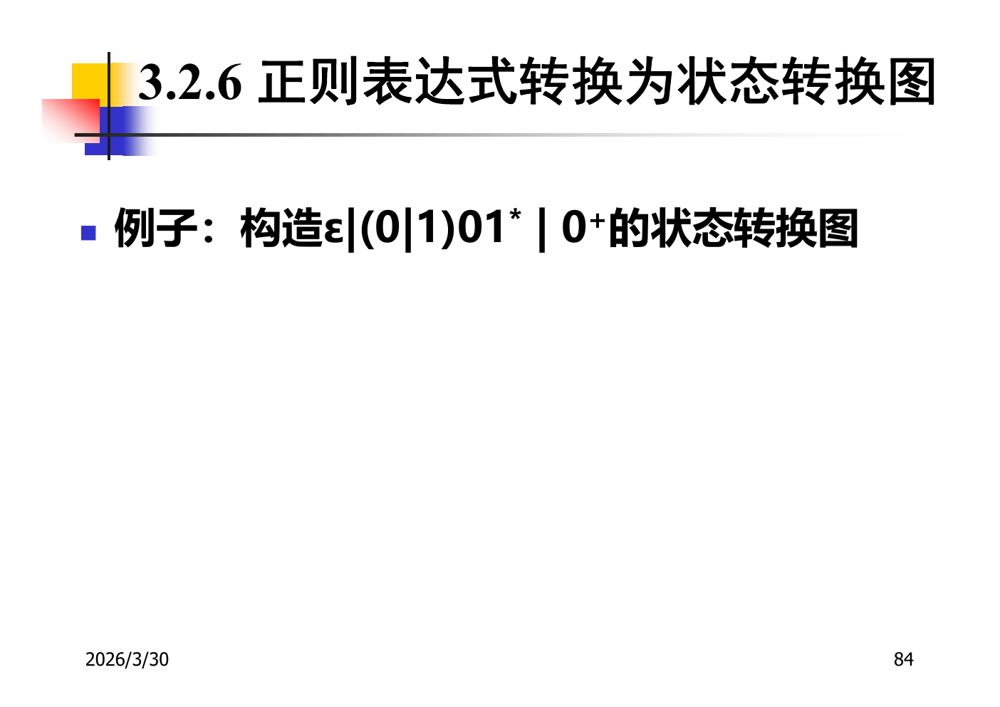

答案要点：

- `ε`：开始状态可通过空边到终态，或开始状态本身为终态。
- `(0|1)01*`：先读 `0` 或 `1`，再读 `0`，再读任意多个 `1`。
- `0+`：至少一个 `0`，后续任意多个 `0`。

解析：整体是并集，用一个新开始状态通过 `ε` 边连接三个子图，再汇到终态。

### 7. 不同进制无符号整数识别

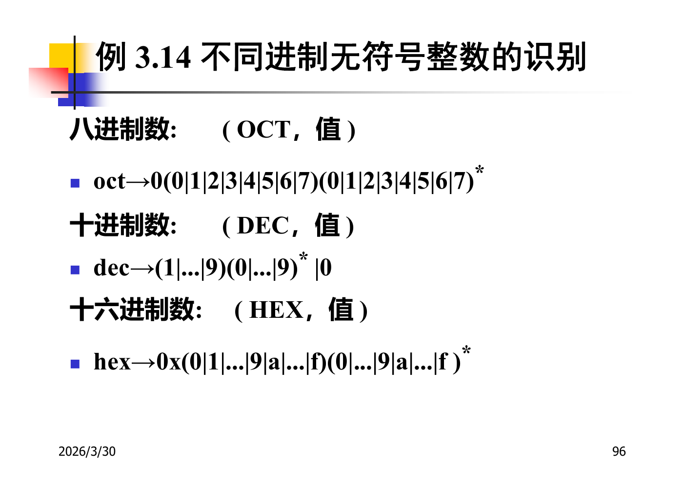

答案要点：

- 十进制：非零数字开头后接数字，或单独 `0`。
- 八进制：通常以 `0` 开头，后接 `0..7`。
- 十六进制：通常以 `0x/0X` 开头，后接 `0..9/a..f/A..F`。

解析：状态图区分“读到前缀”“读到合法数字”“非法数字”。

### 8. 导读练习：token 序列

题：`if count<=10 then count:=count+1`

答案：

```text
(if, -)
(id, count)
(relop, <=)
(num, 10)
(then, -)
(id, count)
(assign, :=)
(id, count)
(addop, +)
(num, 1)
```

解析：`<=` 必须按最长匹配作为一个关系运算符，不能拆成 `<` 和 `=`。

### 9. 导读练习：`a(a|b)*b` 的右线性文法

答案：

```text
S → aA
A → aA | bA | b
```

解析：首位由 `S→aA` 保证；`A→b` 负责最后以 `b` 结束。

### 10. 导读练习：NFA 子集构造

NFA：`q0 --a--> q0`，`q0 --a--> q1`，`q1 --b--> q1`，初态 `q0`，终态 `q1`。

答案：

| DFA 状态 | NFA 状态集合 | 读 a | 读 b | 终态? |
| --- | --- | --- | --- | --- |
| A | `{q0}` | B | Ø | 否 |
| B | `{q0,q1}` | B | C | 是 |
| C | `{q1}` | Ø | C | 是 |
| Ø | `∅` | Ø | Ø | 否 |

解析：DFA 的一个状态是 NFA 状态集合；集合中含 `q1` 即为终态。

---

## 第 4 章 自顶向下语法分析

### 1. `S→xAy, A→**|*`，输入 `x**y`

答案：

```text
S ⇒ xAy ⇒ x**y
```

解析：选择 `A→**` 可成功；若先试 `A→*`，得到 `x*y`，与输入不符，需要回溯。

### 2. 表达式文法 FIRST 集

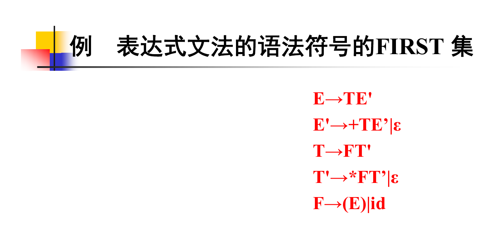

文法：

```text
E  → T E'
E' → + T E' | ε
T  → F T'
T' → * F T' | ε
F  → (E) | id
```

答案：

```text
FIRST(F)  = {(, id}
FIRST(T') = {*, ε}
FIRST(T)  = {(, id}
FIRST(E') = {+, ε}
FIRST(E)  = {(, id}
```

解析：`E` 的首符号来自 `T`，`T` 的首符号来自 `F`。

### 3. 表达式文法 FOLLOW 集

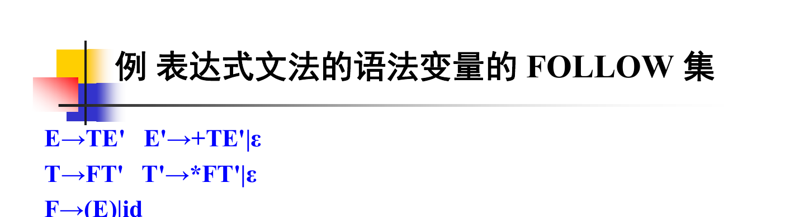

答案：

```text
FOLLOW(E)  = {), #}
FOLLOW(E') = {), #}
FOLLOW(T)  = {+, ), #}
FOLLOW(T') = {+, ), #}
FOLLOW(F)  = {*, +, ), #}
```

解析：开始符号含 `#`；`F` 后可能接 `T'` 的 `*`，若 `T'⇒ε`，还继承 `FOLLOW(T)`。

### 4. 非 LL(1)：`S→cAd, A→ab|a`

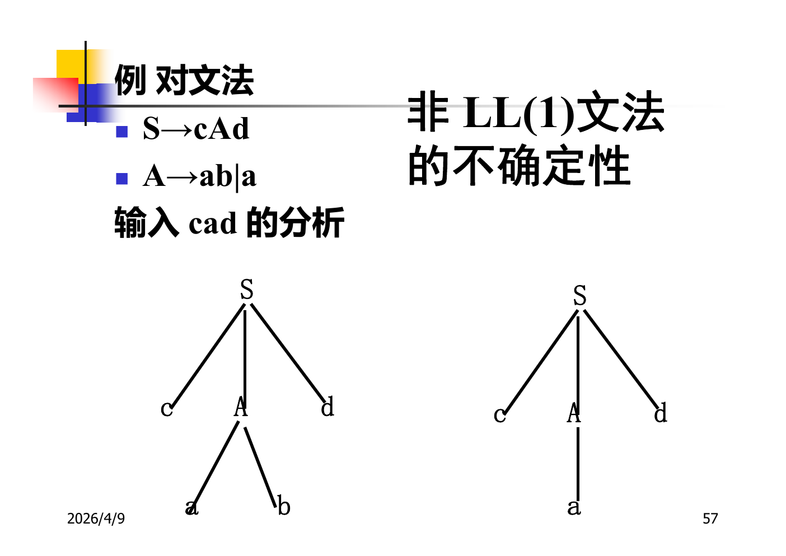

答案：

```text
FIRST(ab) = {a}
FIRST(a)  = {a}
```

同一非终结符 `A` 的两个候选式 FIRST 集相交，所以不是 LL(1)。

改写：

```text
S → c A d
A → a A'
A' → b | ε
```

解析：原文法需要看到第二个符号才能决定 `A→ab` 还是 `A→a`，违反 1 个向前看符号的要求。

### 5. 消除表达式文法左递归

答案：

```text
E  → T E'
E' → + T E' | ε
T  → F T'
T' → * F T' | ε
F  → (E) | id
```

解析：形如 `A→Aα|β` 改写为 `A→βA'`，`A'→αA'|ε`。

### 6. FIRST/FOLLOW/SELECT 小练习

文法：`S→aA|b`，`A→c|ε`。

答案：

```text
FIRST(S) = {a,b}
FIRST(A) = {c,ε}
FOLLOW(S) = {#}
FOLLOW(A) = {#}

SELECT(S→aA) = {a}
SELECT(S→b) = {b}
SELECT(A→c) = {c}
SELECT(A→ε) = {#}
```

解析：同左部候选式 SELECT 集不相交，因此该文法是 LL(1)。

### 7. 预测分析表构造

答案方法：

对每个产生式 `A→α`：

- 对每个 `a∈FIRST(α)-{ε}`，填 `M[A,a]=A→α`。
- 若 `ε∈FIRST(α)`，对每个 `b∈FOLLOW(A)`，填 `M[A,b]=A→α`。
- 空表项为 error。

解析：LL(1) 表项不能冲突；冲突说明不是 LL(1) 或文法需改写。

### 8. 递归下降子程序

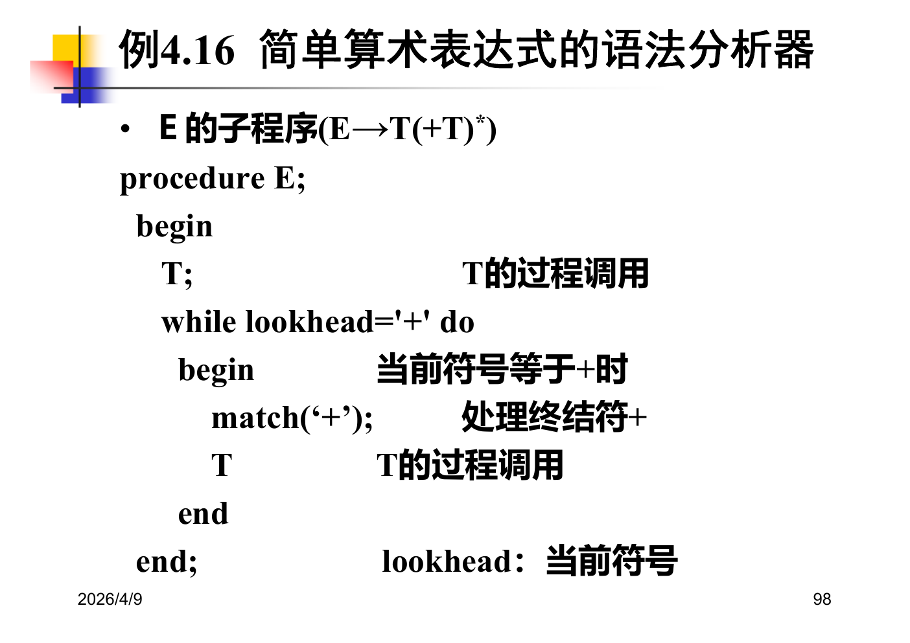

以 `E'→+TE'|ε` 为例：

```text
procedure Eprime:
  if lookahead == '+':
    match('+')
    T()
    Eprime()
  else if lookahead in FOLLOW(Eprime):
    return
  else:
    error()
```

解析：每个非终结符一个过程；终结符用 `match` 匹配；`ε` 分支通常由 FOLLOW 集触发。

---

## 第 5 章 自底向上语法分析

### 1. 例 5.1：归约 `abbcde`

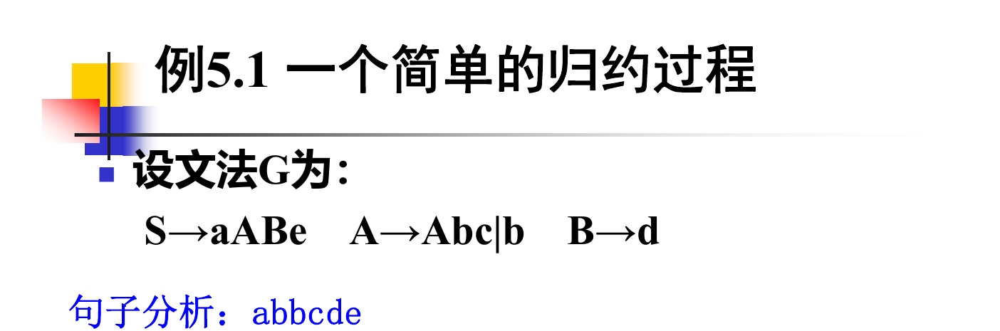

文法：`S→aABe`，`A→Abc|b`，`B→d`。

答案：

```text
abbcde
⇒ 归约 b 为 A: aAbcde
⇒ 归约 Abc 为 A: aAde
⇒ 归约 d 为 B: aABe
⇒ 归约 aABe 为 S: S
```

解析：自底向上分析不断找句柄并归约，最终得到开始符号。

### 2. 算符优先关系

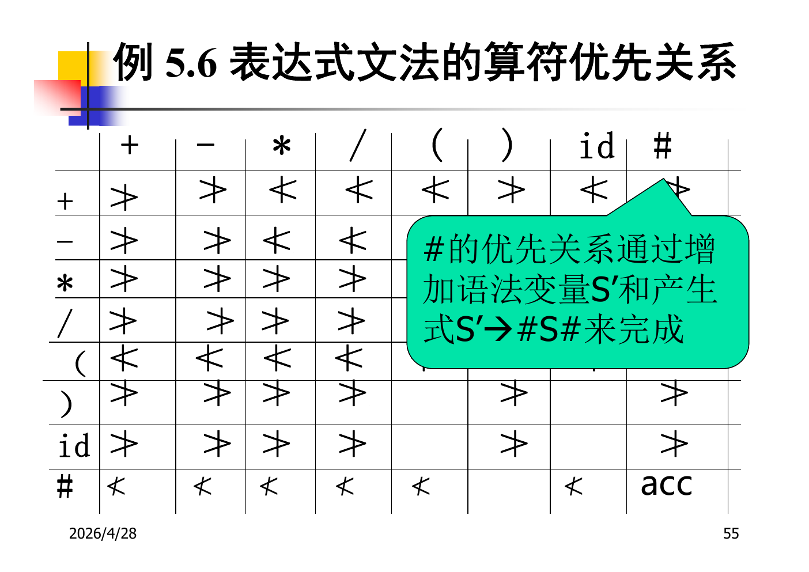

答案方法：

- 若产生式右部出现相邻终结符 `ab`，则 `a =· b`。
- 若出现 `aB`，则对 `b∈FIRSTOP(B)`，有 `a <· b`。
- 若出现 `Ba`，则对 `b∈LASTOP(B)`，有 `b >· a`。

解析：算符优先表用于判断何时移进、何时归约。

### 3. 例 5.7：算符优先分析 `id+id`

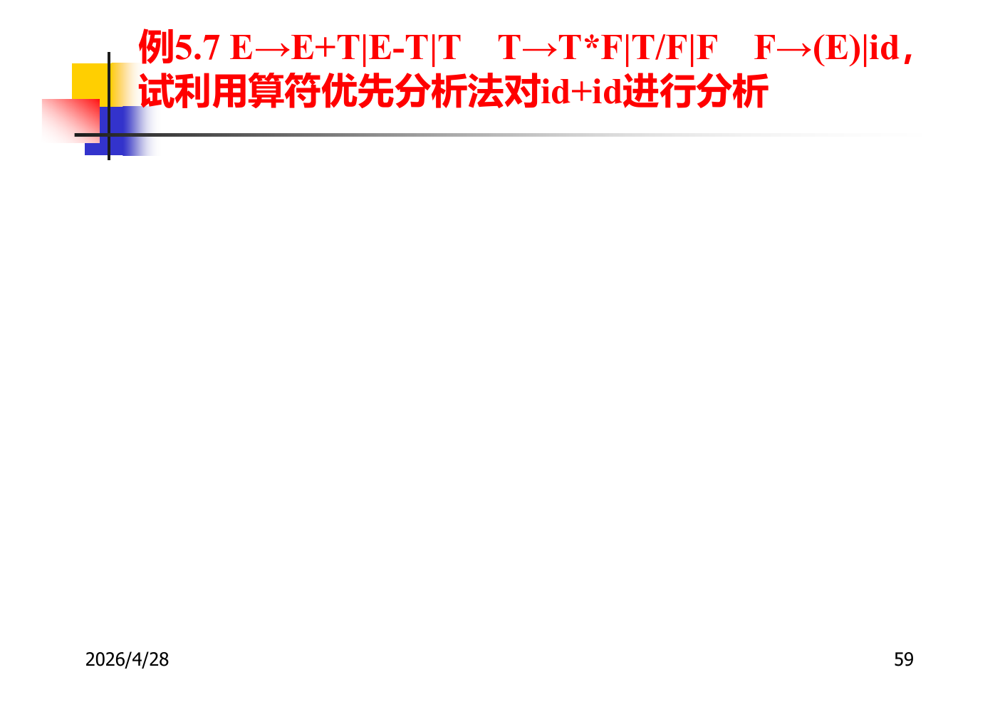

核心过程：

```text
# id + id #
移进 id，归约为 F/T/E
看到 +，移进 +
移进 id，归约为 F/T/E
按 E+T 或 E+E 的结构归约
最终 # E # 接受
```

解析：实际填写时用“步骤、栈、输入串、优先关系、动作”五列。

### 4. 素短语：`T+T*F+id`

答案要点：

- 短语可包括 `T`、`T*F`、`id`、`T+T*F` 等，依赖完整语法树。
- 素短语是不再含更小短语的短语。
- 最左素短语是算符优先分析下一步归约对象。

解析：算符优先分析不是找普通句柄，而是利用终结符优先关系找最左素短语。

### 5. LR(0) 项目集与 DFA：`S'→S, S→BB, B→aB|b`

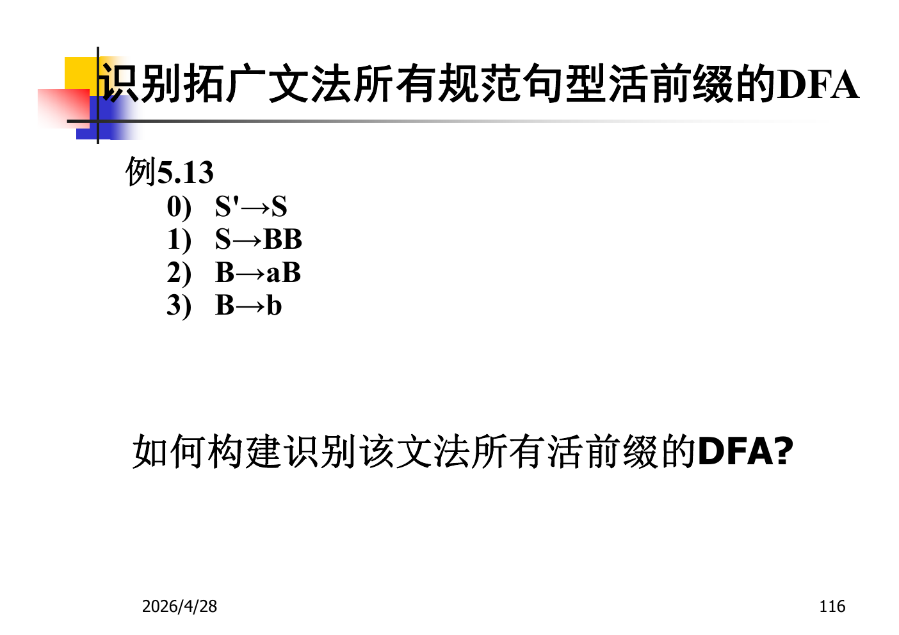

答案项目集：

```text
I0:
S'→.S
S →.BB
B →.aB
B →.b

I1:
S'→S.

I2:
S →B.B
B →.aB
B →.b

I3:
B →a.B
B →.aB
B →.b

I4:
B →b.

I5:
S →BB.

I6:
B →aB.
```

解析：`CLOSURE` 遇到圆点后是非终结符就加入该非终结符的所有产生式；`GOTO(I,X)` 表示圆点越过 `X`。

### 6. LR(0) 分析表

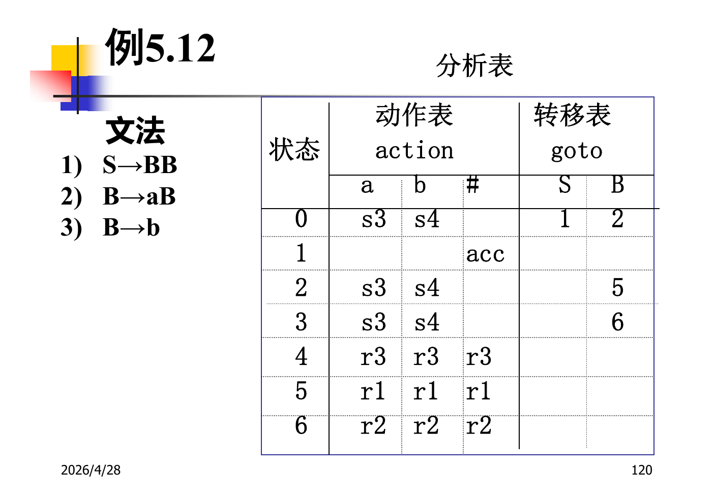

答案：

| 状态 | a | b | # | S | B |
| --- | --- | --- | --- | --- | --- |
| 0 | s3 | s4 |  | 1 | 2 |
| 1 |  |  | acc |  |  |
| 2 | s3 | s4 |  |  | 5 |
| 3 | s3 | s4 |  |  | 6 |
| 4 | r3 | r3 | r3 |  |  |
| 5 | r1 | r1 | r1 |  |  |
| 6 | r2 | r2 | r2 |  |  |

产生式编号：

```text
1) S→BB
2) B→aB
3) B→b
```

解析：LR(0) 归约项目对所有终结符和 `#` 都填归约动作，因此容易冲突。

### 7. SLR 修正

答案规则：若状态含归约项目 `A→α.`，SLR 不在所有终结符上填 `r`，只在 `FOLLOW(A)` 上填归约。

解析：SLR 利用 FOLLOW 限制归约发生的输入符号，能消除一部分 LR(0) 冲突。

### 8. LR 冲突判断

答案：

- 项目集中同时有移进项目和归约项目：移进-归约冲突。
- 项目集中有两个或更多归约项目：归约-归约冲突。
- 没有上述冲突：LR(0) 相容状态。

解析：表项中同一个位置要填两个动作，就产生冲突。

---

## 第 6 章 语法制导翻译与属性文法

### 1. 台式计算器 SDD

答案示例：

```text
L → E n        { print(E.val) }
E → E1 + T     { E.val = E1.val + T.val }
E → T          { E.val = T.val }
T → T1 * F     { T.val = T1.val * F.val }
T → F          { T.val = F.val }
F → digit      { F.val = digit.lexval }
```

解析：这里只用综合属性，属性值自底向上传递，所以是 S-属性定义。

### 2. 依赖图

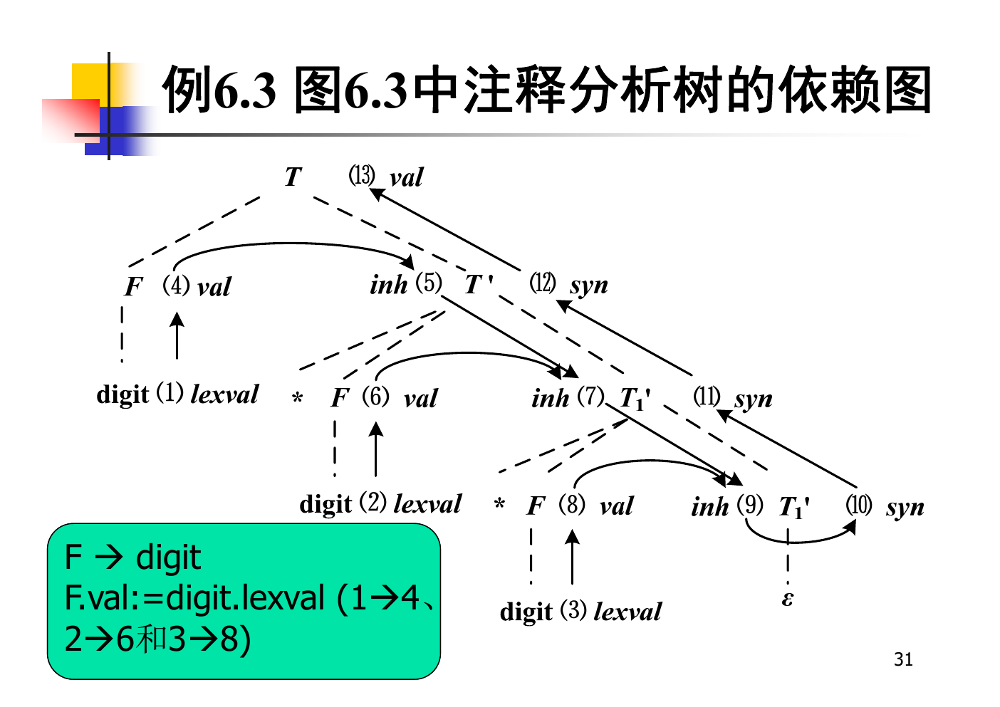

答案方法：

1. 为每个属性实例建一个结点。
2. 若 `b=f(c1,...,ck)`，则从每个 `ci` 向 `b` 画边。
3. 对依赖图做拓扑排序，得到属性求值顺序。

解析：有环说明属性定义不能按普通依赖顺序求值。

### 3. AST 构造：`3*x/y`

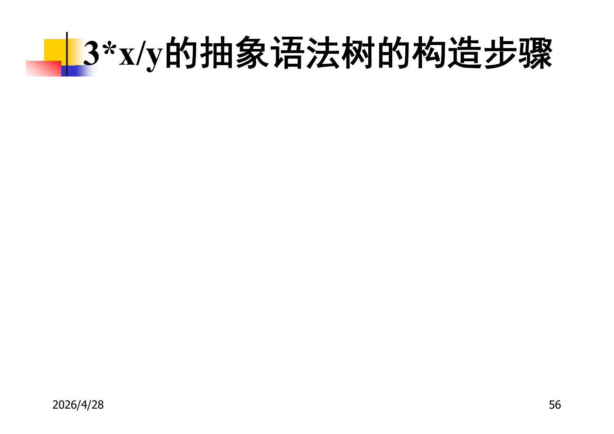

答案：

```text
      /
     / \
    *   y
   / \
  3   x
```

若用函数：

```text
n1 = mkleaf(num, 3)
n2 = mkleaf(id, x)
n3 = mknode('*', n1, n2)
n4 = mkleaf(id, y)
n5 = mknode('/', n3, n4)
```

解析：`*` 和 `/` 左结合，所以 `3*x/y` 等价于 `(3*x)/y`。

### 4. 中缀转后缀翻译模式

答案示例：

```text
E → T R
R → + T { print('+') } R | - T { print('-') } R | ε
T → F S
S → * F { print('*') } S | / F { print('/') } S | ε
F → digit { print(digit.lexeme) } | (E)
```

解析：运算符动作放在右操作数翻译之后，就能输出后缀式。

### 5. 例 6.17：`3*x/y` 的翻译

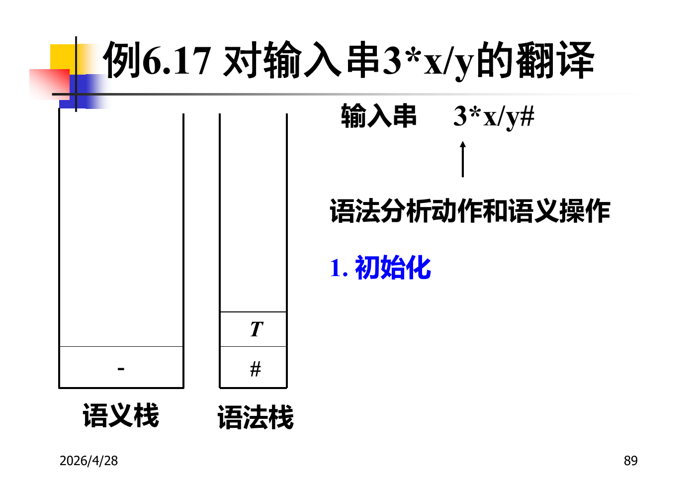

答案：后缀式为：

```text
3 x * y /
```

解析：根据左结合，先输出 `3 x *`，再和 `y` 组成除法，输出 `/`。

### 6. 判断 S-属性与 L-属性

答案：

- 只含综合属性：S-属性定义。
- 对产生式 `A→X1X2...Xn`，`Xi` 的继承属性只能依赖 `A` 的继承属性和 `X1...X(i-1)` 的属性：L-属性定义。

解析：所有 S-属性定义都是 L-属性定义，但反过来不一定。

---

## 第 7 章 语义分析与中间代码生成

### 1. 中缀、前缀、后缀

答案：

| 中缀 | 前缀 | 后缀 |
| --- | --- | --- |
| `a+b` | `+ab` | `ab+` |
| `a*(b+c)` | `*a+bc` | `abc+*` |
| `(a+b)*(c+d)` | `*+ab+cd` | `ab+cd+*` |
| `a:=a*b+c*d` | `:=a+*ab*cd` | `aab*cd*+=` |

解析：后缀式的运算顺序就是运算符出现顺序。

### 2. `a:=(-b)*(c+d)-(c+d)` 的三地址码

答案：

```text
t1 := minus b
t2 := c + d
t3 := t1 * t2
t4 := c + d
t5 := t3 - t4
a := t5
```

优化后可复用 `c+d`：

```text
t1 := minus b
t2 := c + d
t3 := t1 * t2
t5 := t3 - t2
a := t5
```

解析：未优化三地址码通常直接按语法树生成；DAG 优化会合并公共子表达式。

### 3. `a+a*(b-c)-(b-c)/d` 的 DAG

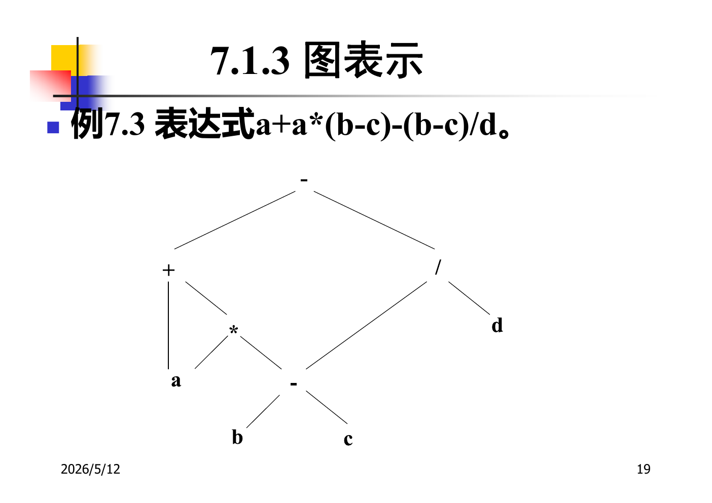

答案要点：公共子表达式是 `b-c`，只建一个 `-` 结点供乘法和除法共同使用。

解析：DAG 与普通语法树的区别是相同表达式共享结点，便于公共子表达式删除。

### 4. 声明语句 offset

题：`int a; real b; int c;`，`int=4`，`real=8`，初始 `offset=0`。

答案：

| 名字 | 类型 | 宽度 | offset |
| --- | --- | --- | --- |
| a | int | 4 | 0 |
| b | real | 8 | 4 |
| c | int | 4 | 12 |

结束后 `offset=16`。

解析：每登记一个名字，当前 offset 是它的相对地址，然后 `offset += width`。

### 5. 数组地址计算

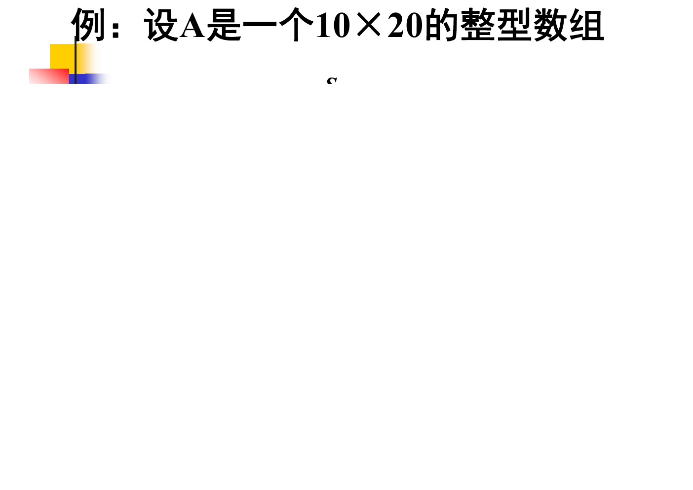

题：`A[1:3,0:4]`，行优先，元素宽度 4。

答案：

```text
位移(A[i,j]) = ((i-1)*5 + (j-0))*4
A[2,3] 位移 = ((2-1)*5+3)*4 = 32
```

解析：第二维长度为 `4-0+1=5`。行优先时第一维每加 1，要跳过一整行 `5` 个元素。

### 6. 布尔表达式 `a<b or c<d and e<f`

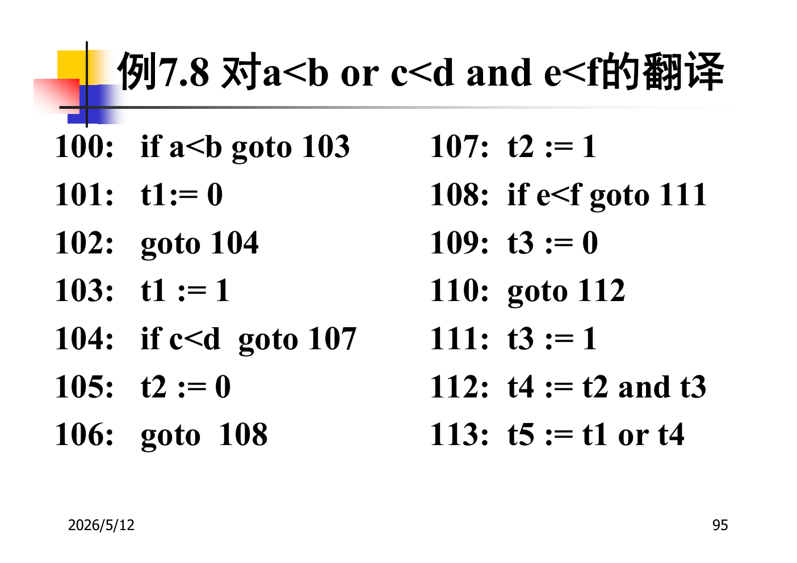

控制流翻译答案：

```text
if a < b goto Ltrue
goto L1
L1: if c < d goto L2
goto Lfalse
L2: if e < f goto Ltrue
goto Lfalse
```

解析：`and` 优先级高于 `or`；`or` 左边真则整体真，`and` 左边假则整体假。

### 7. `if a<b then x:=1 else x:=2`

答案：

```text
if a < b goto Lthen
goto Lelse
Lthen:
x := 1
goto Lnext
Lelse:
x := 2
Lnext:
```

解析：then 分支结束后必须跳过 else 分支。

### 8. 例 7.10：while + if-else

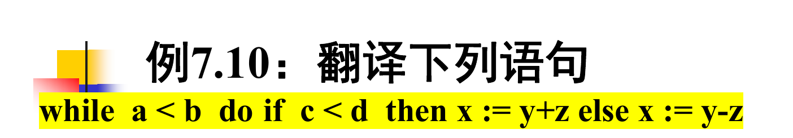

题：`while a < b do if c < d then x := y+z else x := y-z`

答案：

```text
Lbegin:
if a < b goto Lif
goto Lnext
Lif:
if c < d goto Lthen
goto Lelse
Lthen:
t1 := y + z
x := t1
goto Lbegin
Lelse:
t2 := y - z
x := t2
goto Lbegin
Lnext:
```

解析：while 体执行完要跳回循环测试；if 的两个分支都在循环体内。

### 9. 过程调用 `y := f(a, b+1)`

答案：

```text
t1 := b + 1
param a
param t1
t2 := call f, 2
y := t2
```

解析：`param` 个数和 `call f, 2` 的实参数一致；若调用约定要求逆序压参，`param` 顺序随约定调整。

### 10. 回填式翻译

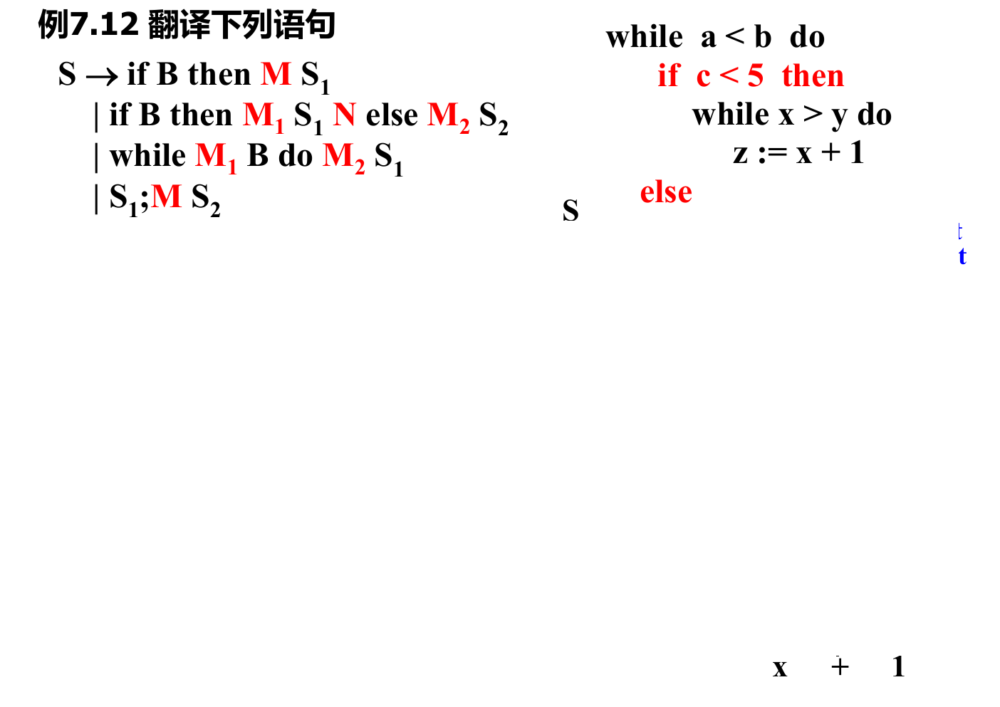

答案要点：

- `makelist(i)`：创建只含跳转指令 `i` 的链。
- `merge(p1,p2)`：合并两条未定目标链。
- `backpatch(p,i)`：把链 `p` 中所有空目标填为 `i`。

解析：回填解决“一边扫描一边生成跳转代码时目标地址尚未知道”的问题。

### 11. switch 翻译

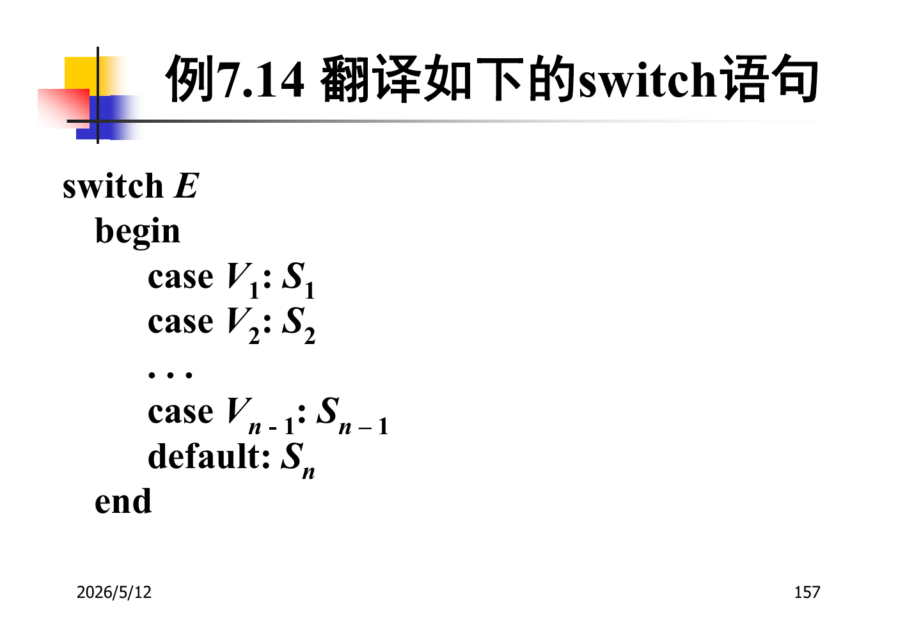

答案模板：

```text
t := E
if t == V1 goto L1
if t == V2 goto L2
...
goto Ldefault
L1: S1; goto Lnext
L2: S2; goto Lnext
...
Ldefault: Sdefault
Lnext:
```

解析：case 可以翻译成顺序比较跳转，也可生成跳转表；考试通常写顺序比较即可。

---

## 第 8 章 符号表管理

### 1. 符号表存放什么

答案：至少存名字和属性。常见属性包括：

```text
kind: 变量/函数/类型/常量/标号
type: 类型
width: 宽度
offset/address: 地址或相对地址
scope: 作用域层次
params: 参数信息
return_type: 返回类型
```

解析：符号表服务语义检查、中间代码生成和目标代码生成。

### 2. 名字字段组织

答案：

- 固定长度名字字段：查找简单，但浪费空间。
- 可变长度字段：节省空间，但表项管理复杂。
- 字符串表：符号表中只存指针/下标，兼顾空间和管理效率。

解析：实际编译器常把标识符字符序列放到统一字符串表。

### 3. 块结构符号表

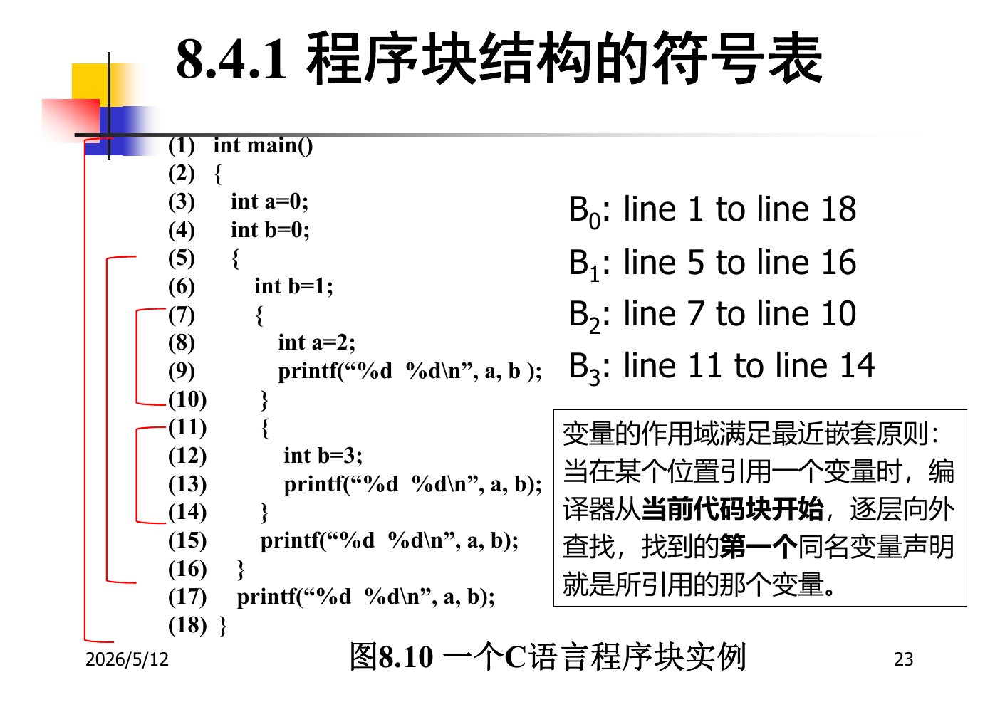

答案方法：

1. 每进入一个块，建立新符号表。
2. 当前块声明插入当前表。
3. 查找名字时先查当前表，再沿外层链向外查。
4. 当前块内同名通常报重复定义；内层块可遮蔽外层同名。

解析：符号表链反映词法嵌套作用域。

### 4. 线性表与散列表

答案：

- 线性表：插入简单，查找平均 `O(n)`。
- 散列表：查找平均接近 `O(1)`，但要处理冲突。

解析：编译器中名字查找频繁，散列表更常用。

### 5. 函数表项设计

答案示例：

```text
name = f
kind = function
return_type = int
param_types = [int, real]
param_count = 2
entry = 代码入口地址
level = 作用域层次
```

解析：函数调用检查需要参数个数、参数类型、返回类型。

---

## 第 9 章 运行时存储组织

### 1. 静态作用域判断

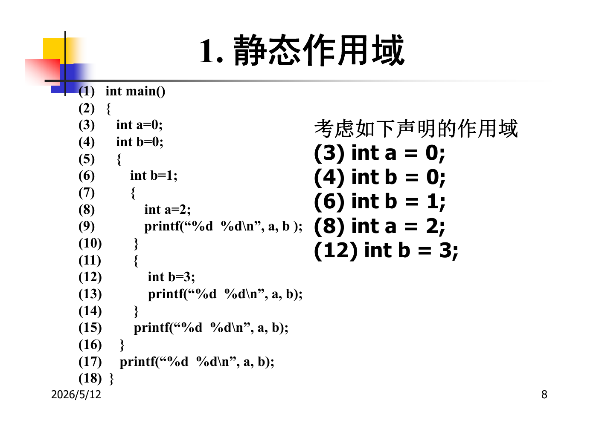

答案原则：

- 在当前块内引用名字，先找最近的声明。
- 内层同名声明遮蔽外层声明。
- 退出内层块后，内层声明不可见。

解析：静态作用域只看程序文本结构，不看运行时调用路径。

### 2. 访问链与控制链

题：`P` 中定义 `Q`，`Q` 中定义 `R`。当前在 `R` 中访问 `P.x`。

答案：沿访问链/静态链从 `R` 到 `Q`，再到 `P`，共两跳，然后按 `x` 的 offset 访问。

解析：控制链指向调用者，反映动态调用关系；访问链指向词法外层，反映静态嵌套关系。

### 3. 活动记录

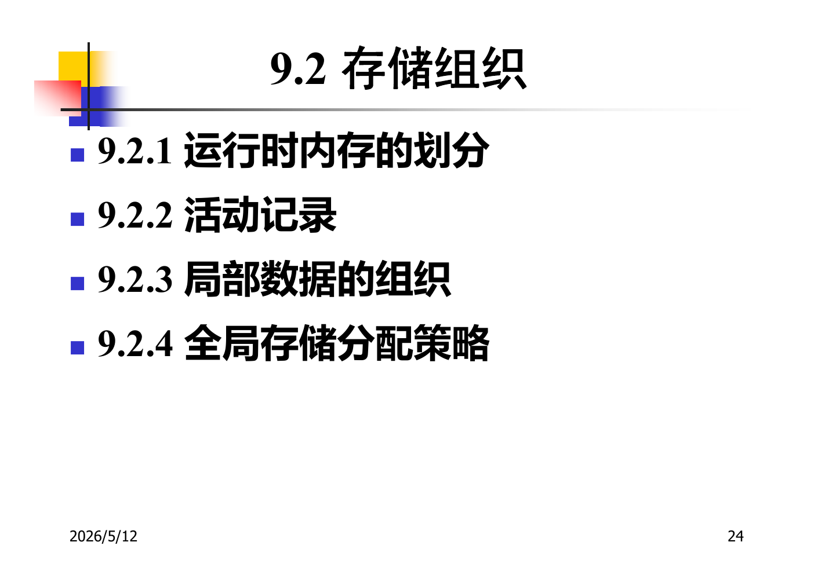

典型布局：

```text
实参区
返回值位置
返回地址
动态链/控制链
静态链/访问链
保存寄存器
局部变量
临时变量
```

解析：一次过程调用对应一个活动记录；递归调用会产生多个活动记录。

### 4. 静态分配、栈分配、堆分配

答案：

| 分配方式 | 适用对象 | 特点 |
| --- | --- | --- |
| 静态分配 | 全局变量、无递归语言的局部对象 | 编译期确定地址 |
| 栈式分配 | 普通过程调用的局部变量、临时变量 | 调用进入分配，返回释放 |
| 堆分配 | 动态对象、生命周期不服从栈顺序的数据 | 需要显式/自动回收 |

解析：关键看对象大小和生命周期能否在编译期或按调用栈确定。

### 5. 参数传递

答案：

- 传值：形参得到实参值副本，修改形参不影响实参。
- 传地址/引用：形参可通过地址修改实参。
- 传名：每次使用形参时重新按实参表达式求值，较少见。

解析：参数传递题常结合活动记录和调用序列考。

---

## 第 10 章 代码优化

### 1. 公共子表达式

答案示例：

```text
t1 := a + b
t2 := a + b
x := t1 * t2
```

若两次之间 `a`、`b` 没变，可优化为：

```text
t1 := a + b
x := t1 * t1
```

解析：公共子表达式成立的条件是表达式相同且操作数值未被改变。

### 2. 复制传播

答案：

```text
f := g
x := f + 1
```

可变为：

```text
f := g
x := g + 1
```

若 `f` 后面不再使用，`f:=g` 可进一步删除。

解析：复制传播本身不一定减少语句，但能制造死代码删除机会。

### 3. 基本块划分

题：

```text
1  t1 := a + b
2  if t1 < c goto 5
3  d := t1 * 2
4  goto 6
5  d := t1 + 1
6  e := d
```

答案：

```text
B1 = {1,2}
B2 = {3,4}
B3 = {5}
B4 = {6}
```

解析：入口语句是 1、跳转目标 5/6、跳转语句后继 3。

### 4. 基本块内公共子表达式优化

题：

```text
t1 := a + b
t2 := a + b
t3 := t2 * c
d := t1
e := d * c
```

出口活跃变量只有 `d` 和 `e`。

答案：

```text
t1 := a + b
d := t1
e := t1 * c
```

解析：`t2` 与 `t1` 等价；`t3` 出口不活跃，可以删除；`d=t1` 后 `e=d*c` 可用 `t1*c`。

### 5. 循环不变式外提

答案模板：

```text
while (...) {
  t := a * b   // a,b 循环内不变
  x := t + i
}
```

优化为：

```text
t := a * b
while (...) {
  x := t + i
}
```

解析：外提前必须确认该计算每次循环都会执行，且外提不会改变异常/副作用语义。

### 6. 强度削弱

答案示例：

```text
2*x     → x+x
x^2     → x*x
i*4     → i << 2      // 定点整数且机器支持时
```

解析：强度削弱用较便宜运算替代较昂贵运算，但必须保持语义等价。

---

## 第 11 章 代码生成

### 1. `x := y + z` 的目标代码

答案：

```text
MOV y, R0
ADD z, R0
MOV R0, x
```

解析：朴素代码生成先装入一个操作数，再执行运算，最后存回结果。

### 2. `a := b + c; d := a + e` 的优化

答案：朴素代码可能是：

```text
MOV b, R0
ADD c, R0
MOV R0, a
MOV a, R0
ADD e, R0
MOV R0, d
```

若 `a` 后续不需要存入内存，可优化为：

```text
MOV b, R0
ADD c, R0
ADD e, R0
MOV R0, d
```

解析：`MOV R0,a` 和 `MOV a,R0` 是为了保存/再取 `a`，若语义上不需要保留 `a`，可删除。

### 3. 特殊指令

答案：

```text
a := a + 1
```

若目标机支持，可生成：

```text
INC a
```

解析：指令选择应利用目标机器提供的高效指令。

### 4. 窥孔优化

题：

```text
MOV a, R0
MOV R0, b
MOV b, R0
ADD c, R0
MOV R0, d
```

答案：

```text
MOV a, R0
MOV R0, b
ADD c, R0
MOV R0, d
```

解析：第二条后 `R0` 已经等于 `b` 的值，第三条 `MOV b,R0` 冗余。前提是中间没有标号、别名或副作用改变 `b/R0`。

### 5. 不可达代码消除

答案模板：

```text
goto L1
x := 1     // 若无标号可跳入，删除
L1:
y := 2
```

优化为：

```text
goto L1
L1:
y := 2
```

解析：无条件跳转后的无标号代码不会执行。

### 6. 寄存器分配与指派

答案：

- 寄存器分配：决定哪些变量/临时值放入寄存器。
- 寄存器指派：决定它们具体放入哪个寄存器。

解析：寄存器少时，要根据变量活跃性和使用频率决定谁留在寄存器，谁溢出到内存。

---

## 总题型答案模板

### A. 文法构造

答案步骤：

1. 写合法/非法样例。
2. 找约束：开头、结尾、数量相等、嵌套、局部禁忌。
3. 设计非终结符分工。
4. 用样例推导检查是否多生成/漏生成。

### B. 二义性证明

标准答案：

```text
取句子 w = ...
存在最左推导 1: ...
存在最左推导 2: ...
两条最左推导不同，所以文法二义。
```

或画两棵不同语法树。

### C. DFA/NFA

答案步骤：

1. 正则式先 Thompson 构造 NFA。
2. 子集法确定化。
3. 终态/非终态初分组。
4. 按输入转移目标组细分，直到稳定。

### D. LL(1)

答案步骤：

```text
消除左递归/提左因子
求 FIRST
求 FOLLOW
求 SELECT
检查同左部 SELECT 是否相交
构造预测分析表
```

### E. LR 分析表

答案步骤：

```text
增广文法
列项目
求 CLOSURE/GOTO
画项目集 DFA
填 ACTION/GOTO
检查冲突
```

### F. 中间代码

答案步骤：

表达式：先按优先级生成临时变量。  
布尔表达式：写真出口/假出口，注意短路。  
控制结构：先画目标代码结构，再填标号。  
数组：先算相对位移，再生成取数/赋值代码。

### G. 运行时存储

答案步骤：

```text
判断作用域规则
画活动记录
区分控制链和访问链
按静态层次差找非局部变量
说明调用序列/返回序列
```

### H. 优化与代码生成

答案步骤：

```text
划基本块
看变量是否活跃
合并公共子表达式
做复制/常量传播
删死代码
生成目标指令
做窥孔优化
```
